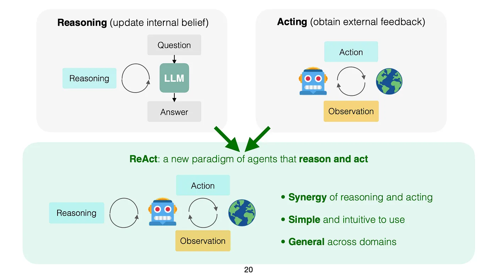
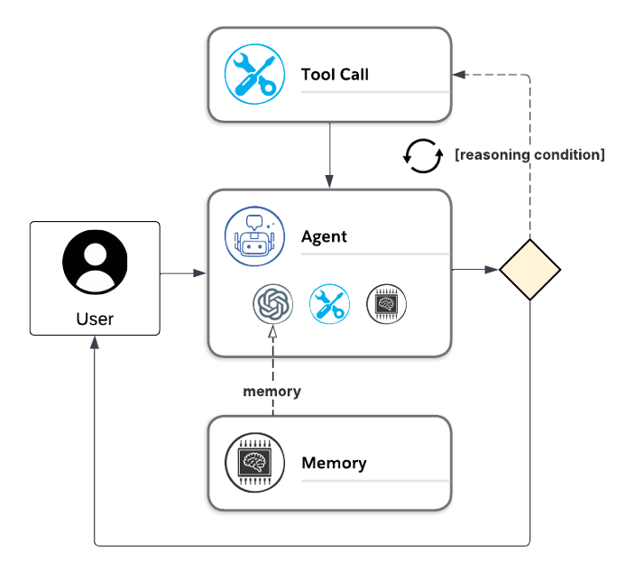

# ReAct (Reasoning + Acting) Pattern

## Context
Invoking an LLM is done using a request / response approach. The LLM is provided context information and prompts. These are used together to generate a single response. Although, some LLM's may reason (think) over the context and internal knowledge they have, they will not independently interact with the outside world to collect more information when needed.

Agents often face complex tasks that require dynamic problem-solving. Without a structured approach, agents may struggle to:
- Reason about tasks in a step-by-step manner.
- Dynamically adapt their actions based on new observations.
- Integrate reasoning and acting into a cohesive process.


## Problem Statement
An approach is needed that lets agents extend beyond a single request / request call to the LLM in order to:
- Reason about tasks in a step-by-step manner.
- Dynamically adapt their actions based on new observations.
- Integrate reasoning and acting into a cohesive process.


## Solution
The ReAct (Reasoning + Acting) pattern is a systematic approach for enabling agents to alternate between reasoning about tasks and taking actions in an iterative loop. This pattern allows agents to dynamically solve problems by grounding their reasoning in observable results from actions. The agent thinks step-by-step about what to do next, takes an action using tools, observes results, and then reasons about the next step. This iterative process continues until the agent determines that it has enough information to complete the task.

The ReAct pattern addresses these challenges by combining reasoning and acting in a unified framework. The agent alternates between reasoning and acting, using the results of each action to inform subsequent reasoning. This approach enables agents to:
- Dynamically adapt to new information.
- Solve complex tasks through grounded reasoning.
- Integrate tool outputs into their decision-making process.

Here is an overview of this pattern from the article titled, "LLM Agents and Agentic Design Patterns" on [towardsai.net](towardsai.net):
> 
> reference: [LLM Agents and Agentic Design Patterns](https://towardsai.net/p/machine-learning/llm-agents-and-agentic-design-patterns-5)

ReAct often integrates three core concepts:
- **Tool Calling**: Allowing the LLM to select and use various tools as needed.
- **Memory**: Enabling the agent to retain and use information from previous steps.
- **Planning**: Empowering the LLM to create and follow multi-step plans to achieve goals.

### Key Steps in the ReAct Pattern
1. **Reasoning**: The agent thinks about the task and determines the next action to take.
2. **Acting**: The agent performs the action using a tool or external system.
3. **Observation**: The agent observes the results of the action.
4. **Iteration**: The agent uses the observations to inform the next reasoning step.

This loop continues until the agent determines that it has achieved the desired outcome.

Implementations of ReAct might incorporate other patterns (e.g., LLM as a Judge) in order to achieve its goals, but here is an example of the simplest implementation that uses reasoning in conjunction with Tool Calling (see [Tool Calling Pattern](../tool-calling/)):



## Use Cases
The ReAct pattern is applicable in various scenarios, including:
- **Dynamic Problem-Solving**: Tasks that require iterative reasoning and action.
- **Tool Integration**: Scenarios where agents need to use external tools to complete tasks.
- **Complex Decision-Making**: Situations that involve multi-step planning and execution.

## Example
Code samples providing an example of this pattern can be found here:
- Agent Framework (C#): [./agent-framework](./agent-framework)

Here is a basic pseudo code example of the ReAct pattern in action:

```python
# Reasoning step
agent_thought = "I need to find the weather forecast for tomorrow."

# Acting step
tool_output = call_weather_api("tomorrow")

# Observation step
agent_observation = f"The weather forecast is: {tool_output}"

# Iteration
agent_thought = "Based on the forecast, I will plan my day."
```

## Benefits
- **Improved Problem Solving**: Enables agents to handle tasks requiring both reasoning and action.
- **Real-Time Adaptability**: Allows agents to adjust actions based on new observations.
- **Transparency**: Produces traceable reasoning chains for debugging and trustworthiness.
- **Reduced Hallucination**: By verifying facts through tools, the pattern minimizes errors.

## References
- [ReAct: Synergizing Reasoning and Acting in Language Models (Yao et al., 2022, ICLR), Google Research/Princeton](https://arxiv.org/abs/2210.03629)
- [LLM Agents and Agentic Design Patterns](https://towardsai.net/p/machine-learning/llm-agents-and-agentic-design-patterns-5)
- [ReAct Framework Explained: How Reasoning + Acting Makes AI Smarter](https://pub.towardsai.net/react-framework-explained-how-reasoning-acting-makes-ai-smarter-98f00c74494a)