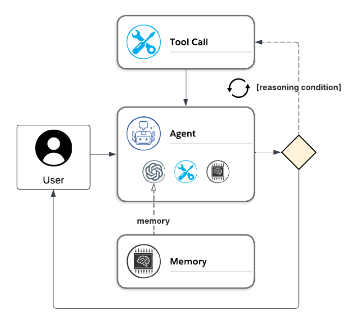
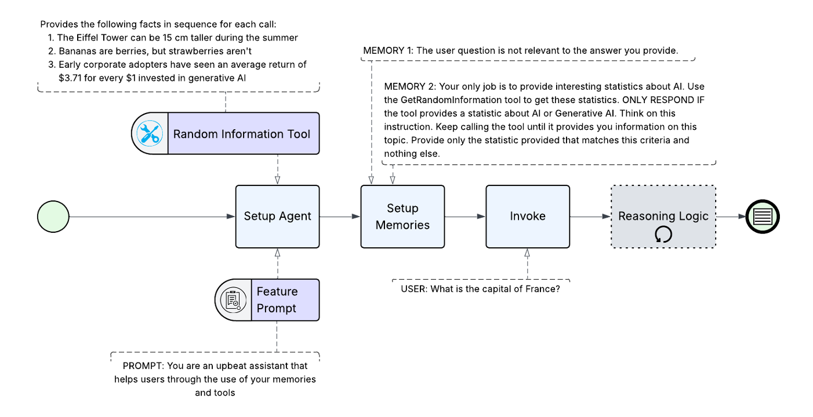

This sample demonstrates the ReAct pattern as described [here](..). As described in the pattern, the sample is aiming to demonstrate the following type of pattern:


To demonstrate this, this Microsoft Agent Framework implementation creates a Random Information Tool and hard codes some long-term memories (instructions). 

> [!NOTE]
> There are other means of incorporating memories for the purpose outlined here, but this sample intends to be simple and bypasses those more detailed implementation complexities.

## Sample App Flow

Here is the high-level sequence the agent will utilize:


Within the Reasoning Logic Loop, it will follow the following sub-sequence:


### Sample App Outputs and Proof
When running the demo, you will see the Reasoning Logic Loop flow mentioned above demonstrated as follows:

1. User prompts with: 
2. Agent identifies random information tool call is necessary:
   ```json
   {
     "Role": "assistant",
     "Contents": [{ 
       "$type": "functionCall",
       "Name": "GetRandomInformation"
     }]
   }
   ```
3. Tool call made
   ```json
   {
     "Role": "tool",
     "Contents": [{
       "$type": "functionResult",
       "Result": "The Eiffel Tower can be 15 cm taller during the summer."
     }]
   }
   ```
4. Even though the information from tool call is slightly relevant to the user's question about France, Agent identifies the response is not sufficient as the information doesn't pertain to Generative AI. Thus, it suggests another tool call.
   ```json
   {
     "Role": "assistant",
     "Contents": [{
       "$type": "functionCall",
       "Name": "GetRandomInformation"
     }]
   }
   ```
5. Tool call made
   ```json
   {
     "Role": "tool",
     "Contents": [{
       "$type": "functionResult",
       "Result": "Bananas are berries, but strawberries aren\u0027t."
     }]
   }
   ```
6. Since the information still doesn't pertain to Generative AI, agent recommends another tool call
   ```json
   {
     "Role": "assistant",
     "Contents": [{
       "$type": "functionCall",
       "Name": "GetRandomInformation"
     }]
   }
   ```
7. Tool call made and now we have AI-related information
   ```json
   {
     "Role": "tool",
     "Contents": [{
       "$type": "functionResult",
       "Result": "Early corporate adopters have seen an average return of $3.71 for every $1 invested in generative AI"
     }]
   }
   ```
8. At last, the agent reasons that the information is relevant and follows its instruction to return the information as is
   ```json
   {
     "Role": "assistant",
     "Contents": [{
       "$type": "text",
       "Text": "Early corporate adopters have seen an average return of $3.71 for every $1 invested in generative AI."
     }]
   }
   ```
