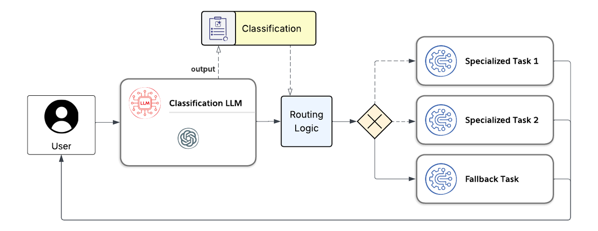

# Router / Classifier Pattern

## Context
In complex systems, user inputs can vary widely in intent and required processing. Different intents may require different models, downstream agents, or tasks that are specialized to the specific intent. Without a mechanism to classify and route these inputs to specialized processing, systems may become monolithic, difficult to maintain, and inefficient.

## Problem Statement
A mechanism is needed to classify and route user inputs to appropriate handling logic or external processes. 

## Solution
The Router Pattern addresses this by introducing an initial agent that acts as a classifier and dispatcher. The **Router Pattern**, also known as the **Classifier Pattern**, is a design pattern used in agent-based systems to classify user input and direct it to the most appropriate specialized task, model, or downstream agent. This pattern emphasizes the separation of concerns, enabling optimization of individual specialized tasks.

The Router Pattern introduces an initial agent responsible for:

1. **Classification**: Analyzing user input to determine its intent or required processing.
2. **Routing**: Directing the input to the appropriate specialized task, model, or downstream agent.


This is depicted in the following pattern diagram:


With the Router / Classifcation pattern, the separation of concerns allows for:
- Modular design
- Scalability
- Easier debugging and maintenance

## Implementation
### Key Components
- **Router Agent**: The initial agent that classifies and routes inputs.
- **Specialized Tasks/Agents**: Downstream agents or models optimized for specific tasks.
- **Feedback Loop**: Optional mechanism for refining classification and routing over time.

## Example
Code samples providing an example of this pattern can be found here:
- [./lang-graph](./lang-graph/)

Here is a simple pseudo code example
```python
class RouterAgent:
    def __init__(self):
        self.specialized_agents = {
            "task1": Task1Agent(),
            "task2": Task2Agent()
        }

    def route(self, user_input):
        task = self.classify(user_input)
        return self.specialized_agents[task].process(user_input)

    def classify(self, user_input):
        # Simple classification logic
        return llm.classify(prompt, user_input)

class Task1Agent:
    def process(self, input):
        return f"Processing {input} in Task1Agent"

class Task2Agent:
    def process(self, input):
        return f"Processing {input} in Task2Agent"

router = RouterAgent()
print(router.route("task1: Do something"))
```

## Benefits
- **Modularity**: Each specialized task can be developed and optimized independently.
- **Scalability**: New tasks or agents can be added without modifying the router.
- **Maintainability**: Clear separation of concerns simplifies debugging and updates.

## Drawbacks
- **Overhead**: Initial classification and routing introduce latency.
- **Complexity**: Requires careful design to avoid bottlenecks or misclassification.

## Use Cases
- **Customer Support**: Routing user queries to the appropriate department or chatbot.
- **AI Systems**: Directing inputs to specific models (e.g., NLP, vision, etc.).
- **Workflow Automation**: Classifying and routing tasks in business processes.

## References
- [Wikipedia: Router (Computing)](https://en.wikipedia.org/wiki/Router_(computing))
- [Towards Data Science: AI Design Patterns](https://towardsdatascience.com)
- [Medium: Agent Design Patterns](https://medium.com)
