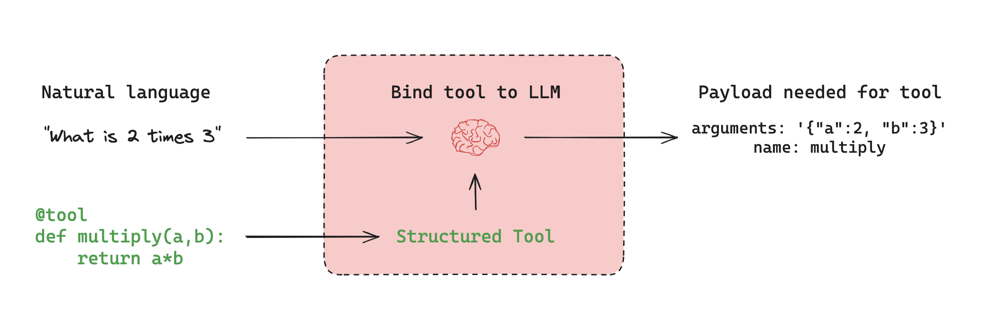
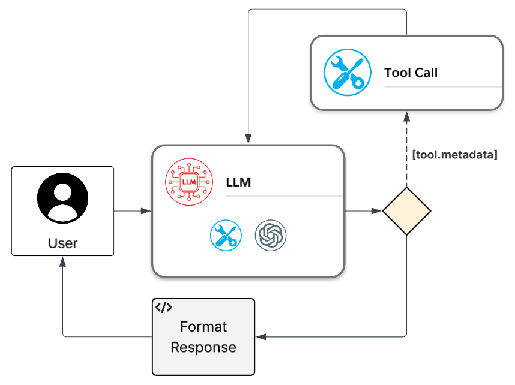

# Tool Calling (Function Calling)

## Context
Large Language Models (LLMs) are powerful in understanding and generating natural language, but they lack the ability to directly interact with external systems. This limitation restricts their utility in scenarios requiring real-world actions, such as querying databases, invoking APIs, or performing computations. 

## Problem Statement
LLM's need a means of addressing the gaps of real-world actions in order to:
- Dynamically call external actions based on the task context.
- Construct structured input arguments for external actions.
- Execute external actions and integrate their outputs into the reasoning process.

## Solution
Tool Calling, also known as Function Calling, is a design pattern that enables agents to interact with external systems, APIs, or functions. This pattern allows agents to go beyond language-only reasoning by invoking external tools to perform specific tasks. By leveraging this pattern, agents can dynamically select and execute tools based on the context of a task, making them capable of performing actions rather than just providing responses.

The Tool Calling pattern often involves the following steps:
1. **Receiving a Query**: The agent receives a natural-language query or task from the user.
2. **Tool Discovery**: The agent searches for available tools, schemas, and capabilities using internal metadata or a tool registry.
3. **Tool Selection and Invocation**: The LLM selects the most relevant tool, constructs input arguments, and generates a structured function call.
4. **Tool Execution**: The selected tool is executed, and the result is returned (e.g., API output, database value, or computation result).
5. **Response Generation**: The agent integrates the tool's output into its reasoning loop and generates a natural-language response.

In the simplest form, incorporating a tool into an LLM call would like like this:

> ref: [https://langchain-ai.github.io/langgraph/concepts/agentic_concepts](https://langchain-ai.github.io/langgraph/concepts/agentic_concepts)

Since the output from the LLM yields just the payload for the tool call, basic implementations of a tool calling workflow will, minimally, have a flow like follows:

## Architecture
The architecture of a Tool Calling agent typically includes:

- **Tool Registry**: A repository of available tools, their schemas, and metadata.
- **LLM**: The core reasoning engine that selects tools and constructs function calls.
- **Tool Runner**: A component that executes the selected tool and returns the result.
- **Response Generator**: A module that integrates tool outputs into the agent's reasoning and generates responses.

## Use Cases
Tool Calling is applicable in various scenarios, including:

- **Virtual Assistants**: Agents that perform actions like sending emails, scheduling meetings, or retrieving data from CRMs.
- **Data Querying**: Agents that execute SQL queries or fetch data from APIs.
- **Dynamic Computations**: Agents that perform calculations or transformations using external functions.
- **Enterprise Applications**: Agents that integrate with business operations, such as invoking AWS Lambda functions or SaaS services.

## Example
Full examples are provided here:
- Agent Framework (C#): [./agent-framework](./agent-framework)
- LangGraph (Python): [./lang-graph](./lang-graph/)

## Benefits
- **Dynamic Tool Selection**: Agents can adapt to various tasks by selecting appropriate tools.
- **Structured Reasoning**: The use of schemas ensures that tool inputs and outputs are well-defined.
- **Enhanced Capabilities**: Agents can perform real-world actions, making them more useful in practical applications.

## Challenges
- **Tool Discovery**: Maintaining an up-to-date registry of tools and their capabilities can be complex.
- **Error Handling**: Agents must handle tool execution errors gracefully.
- **Security**: Ensuring that tool calls are secure and authorized is critical.
